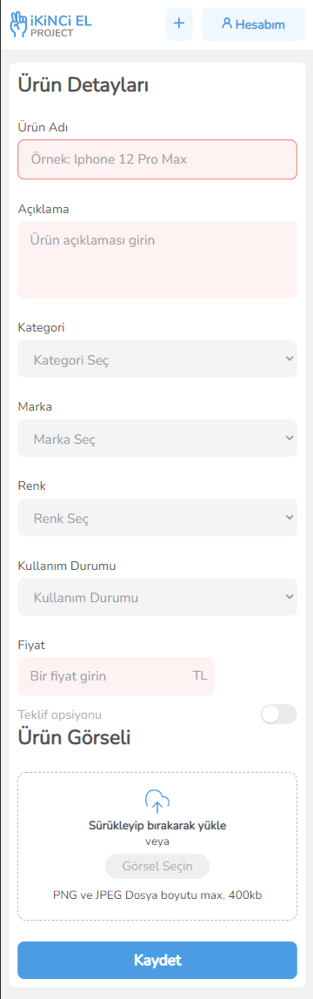

<p align="center">

  <br/>


</p>

It's full featured e-commerce app built as Patika & Protein React Bootcamp final project.

Live demo available here: [ <b> Live Demo</b> ]

## Content

- [Introduction](#introduction)
- [Used Technologies](#used-technologies)
- [Libraries](#libraries)
- [Installation](#installation)
- [Previews](#previews)
- [App Performance](#app-performance)

<br>

# Introduction

- İkinci El Project is an E-Commerce app that allows users create, buy and sell products.

- If you already have an account you can sign-in. Else, you can register easily.
- You can offer products you want and product owner can accept or reject your offered price.
- The app developed for both web and mobile. All pages have responsive UI.

<br>

## Used Technologies

- HTML
- JavaScript
- ReactJS
- SASS
- Axios
- Vercel

<br>

## Libraries

- React-Router
- React-Modals
- React-Dropzone
- React-Hook-Form
- React-Tabs
- React-Toastify

<br>

## Installation

- First, clone the project:

```sh
git clone https://github.com/eakarr/protein-patika-graduation-project.git
```

- Then, start the project on localhost:

```bash
# install dependencies with npm
npm install

# serve at localhost:3000
npm start
```

- To start unit testing:

```bash
# with npm
npm run test
```

<br>
<br>

# Previews

<center>

## Web - Sign Up Page


## Web - Home Page


## Web - Product Detail Page


## Web - Account Page


## Web - Add Product Page


## Mobile

<p align="center">



</p>
</center>

<br>
<br>

# App Performance

## Desktop

<p align="center">
  
</p>

## Mobile

<p align="center">
  
</p>